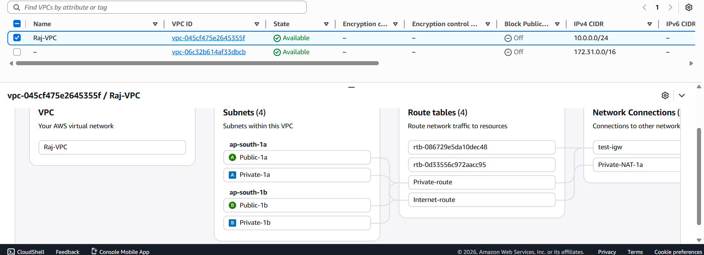
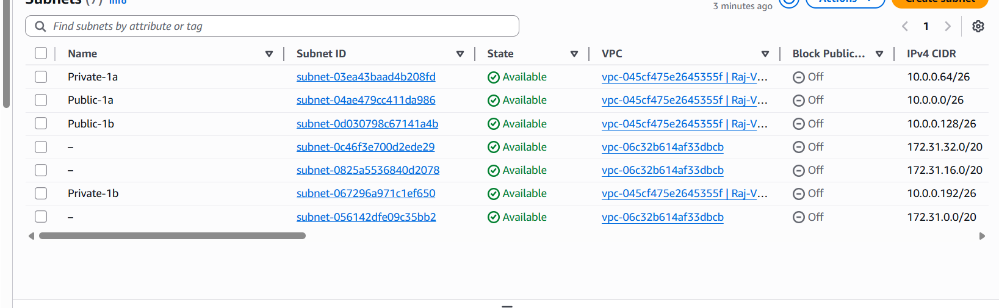
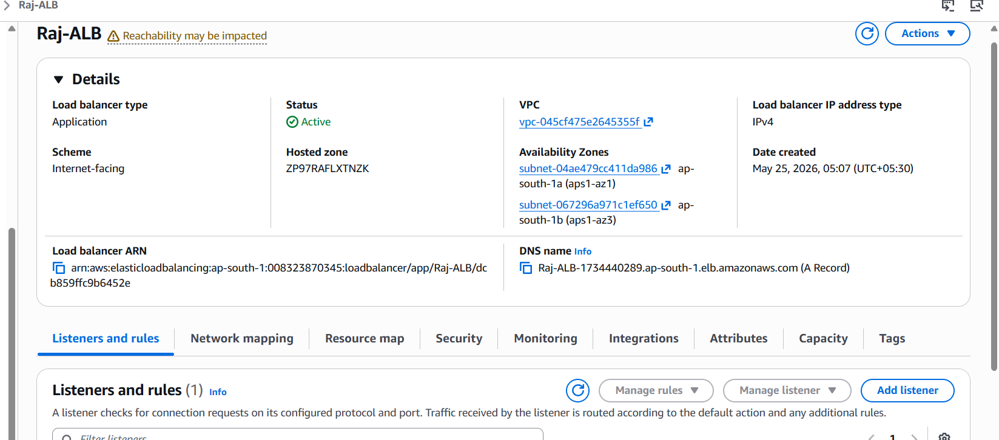
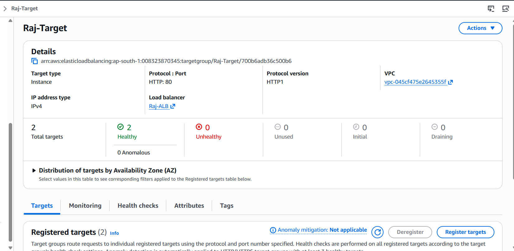
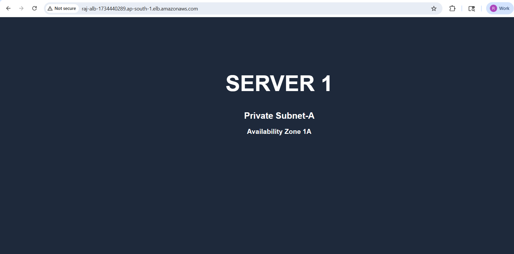
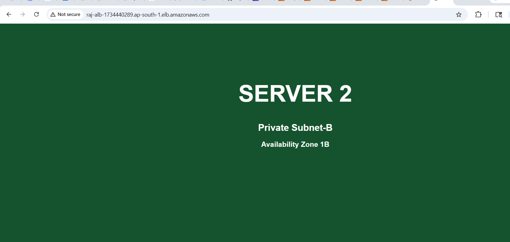

# AWS ALB + Multi-AZ Private EC2 Deployment Project

## Project Description

This project demonstrates a production-style AWS architecture using:

- Application Load Balancer (ALB)
- Multi-AZ Deployment
- Public and Private Subnets
- Private EC2 Instances
- Bastion Host
- Target Groups
- Health Checks
- High Availability

The Application Load Balancer distributes traffic between two private EC2 instances running in different Availability Zones.

---

# Architecture Diagram

```text
                                Internet
                                    │
                                    ▼
                      Application Load Balancer
                           (Public Subnets)
                     ┌────────────┴────────────┐
                     │                         │
             Public Subnet-A           Public Subnet-B
                  AZ-1A                     AZ-1B
                     │                         │
                     └────────────┬────────────┘
                                  │
                           Target Group
                           Health Checks
                          Round Robin Routing
                              /         \
                             /           \
                            ▼             ▼
                  EC2 Server-1     EC2 Server-2
                 Private Subnet-A  Private Subnet-B
                        AZ-1A            AZ-1B

```

---

# AWS Services Used

- VPC
- Public Subnets
- Private Subnets
- EC2
- Bastion Host
- Application Load Balancer
- Target Group
- NAT Gateway
- Internet Gateway
- Route Tables
- Security Groups

---

# Project Features

- Multi-AZ High Availability Architecture
- Load Balancing using ALB
- Round Robin Traffic Distribution
- Private EC2 Deployment
- Health Checks
- Automatic Failover
- Secure SSH Access using Bastion Host
- Production-Style AWS Networking

---

# Traffic Distribution Testing

The ALB distributes requests automatically between both EC2 servers.

Example:

- Request 1 → Server 1
- Request 2 → Server 2
- Request 3 → Server 1

Both servers display different web pages for testing load balancing.

---

# Server Configuration

## Server 1

```text
SERVER 1
Private Subnet-A
AZ-1A
```

## Server 2

```text
SERVER 2
Private Subnet-B
AZ-1B
```

---

# Security Design

## ALB Security Group

- HTTP 80 from Anywhere
- HTTPS 443 from Anywhere

## Bastion Host Security Group

- SSH 22 from My Public IP

## Private EC2 Security Group

- HTTP 80 only from ALB Security Group
- SSH 22 only from Bastion Host

---

# Bastion Host Access

Private EC2 instances are securely accessed through Bastion Host.

```text
Laptop → Bastion Host → Private EC2
```

---

# Health Check & Failover Testing

To test failover:

```bash
sudo systemctl stop nginx
```

Result:

- ALB marked server unhealthy
- Traffic redirected automatically to healthy EC2 instance

---

# Screenshots

## VPC



## Subnets



## EC2 Instances


## Application Load Balancer



## Target Group



## Server 1 Output



## Server 2 Output



---

# Challenges Faced

## ALB Reachability Issue

Issue:
- Public subnet route table was incorrectly pointing to NAT Gateway.

Fix:
- Updated route:

```text
0.0.0.0/0 → Internet Gateway
```

---

## SSH Access Issue

Issue:
- Private EC2 instances had no public IP.

Fix:
- Created Bastion Host in Public Subnet.

---

## Health Check Failure

Issue:
- Target group showing unhealthy.

Fix:
- Started nginx service
- Updated security group rules
- Corrected health check path

---

# Learning Outcomes

- AWS VPC Networking
- Multi-AZ Architecture
- Load Balancing Concepts
- Health Checks
- High Availability
- Bastion Host Access
- Route Tables & NAT Gateway
- Security Group Configuration
- Failover Testing

---

# Project Status

Completed Successfully ✅